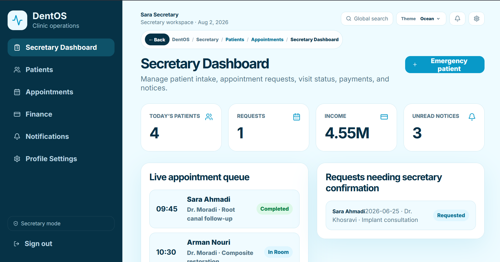

# DentOS: Dental Clinic Management System



This repository contains the system architecture, requirements engineering, and interactive frontend prototype for a comprehensive
Dental Clinic Management System. It was designed to digitize clinic operations, reduce scheduling conflicts, and improve the experience
for staff and patients.

## Team & Roles
This project was a collaborative effort by Saina Pourjafari and Niloofar Asoubar:
* **System Analysis, Agile Management & Architecture:** Niloofar Asoubar
* **UI Design & Frontend Prototype:** Saina Pourjafari

## My Contributions: System Architecture & Agile Workflow
My primary focus was managing the software development lifecycle, extracting business needs, and designing the system architecture.
Showing full-stack competency means understanding the product before writing the code, which I achieved by:
* Defining 72 functional requirements, including role-specific workflows for Secretaries, Dentists, Managers, and Patients.
* Establishing 39 non-functional requirements spanning performance, security, usability, and reliability metrics.
* Managing the project using the Agile Scrum methodology.
* Authoring 48 user stories and organizing them into Jira Epics across 8 development sprints[cite: 1].

*Note: The complete 19-page System Analysis and Design Document is available in the `/docs` folder of this repository.*

## Agile Sprint Plan (Epics)
I structured the product development into the following 8 sprints[cite: 1]:
1. **Secretary Dashboard:** Patient status management and daily tracking[cite: 1].
2. **Login & Authentication:** Role-based access control and security[cite: 1].
3. **Patient Records:** Medical history and condition tracking[cite: 1].
4. **Patient Portal:** Online registration and appointment booking[cite: 1].
5. **Notifications:** Automated SMS and email reminders[cite: 1].
6. **Doctor Panel:** Treatment recording and prescription management[cite: 1].
7. **Manager Reports:** Financial tracking and daily analytics[cite: 1].
8. **Appointment Management:** Advanced time-slot and conflict prevention[cite: 1].

## The Prototype
Based on the system requirements I gathered, my teammate built a feature-first React prototype demonstrating the core user flows
across all 8 epics[cite: 1]. Data is mocked in React state to simulate a live database connection for presentation purposes.

### Quick Start
To run the frontend prototype locally:
```bash
npm install
npm run dev
```

Then open the local URL shown by Vite.

## Build / Present

```bash
npm run build
npm run preview
```

Open the local preview URL shown by Vite. If you want to open `dist/index.html` directly by double-clicking it, `vite.config.ts` sets `base: "./"` so built assets use relative paths.

## Demo Flow

1. Login as `Secretary`.
2. Add a new appointment from the dashboard.
3. Open `Appointments` and click a patient row to move status from waiting to in-room to completed.
4. Open `Patients` and review medical alerts and treatment history.
5. Switch role to `Dentist`, save a clinical note and prescription.
6. Switch role to `Manager`, review reports and toggle staff access.
7. Switch role to `Patient`, request an appointment.
8. Open `Notifications` to send reminder messages.

## Prototype Notes

- Data is fake and stored in React state for the current browser session.
- Actions update shared data across screens.
- The visual style follows the Framer mockups in `framer-images`.
- This is intentionally product-focused, not Jira/story-focused.
